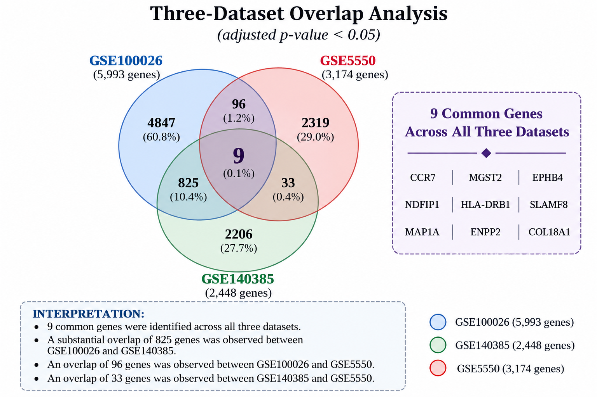

# Computational Reproduction and In Silico Extension of a CML Transcriptomic Study

## Overview

This repository contains the computational analysis developed as part of my undergraduate research project in Molecular Biology and Genetics.

The project was initially designed to reproduce the main findings of a published study investigating the molecular effects of BCR::ABL p210 and BCR::ABL T315I in a *Drosophila melanogaster* model of chronic myeloid leukemia (CML).

After the reproduction step, the analysis was extended to independent human CML gene expression datasets to investigate whether similar biological mechanisms could also be observed in human data.

## Research Question

Can the biological mechanisms reported in the original *Drosophila* CML study also be observed in independent human CML gene expression datasets?

## Datasets

Three independent datasets related to chronic myeloid leukemia were analyzed:

- GSE100026
- GSE140385
- GSE5550

The datasets were obtained from the NCBI Gene Expression Omnibus (GEO).

## Analysis Workflow

GEO
→ Differential Gene Expression Analysis
→ Shared Gene Analysis
→ Functional Enrichment
→ Gene Network Analysis
→ Biological Interpretation

## Methods and Tools

- GEO / GEO2R
- Differential gene expression analysis
- limma
- R / RStudio
- DESeq2
- HISAT2
- samtools
- featureCounts
- g:Profiler
- GeneMANIA

## Main Results

Nine genes were identified as common to all three independent human datasets:

**CCR7, MGST2, EPHB4, NDFIP1, HLA-DRB1, SLAMF8, MAP1A, ENPP2, COL18A1**

Functional analysis indicated that these genes were mainly associated with:

- immune response
- inflammation
- cell communication
- phosphorylation
- related signaling processes

GeneMANIA analysis showed strong co-expression relationships among the shared genes. CCR7 emerged as a potential hub gene candidate.

### Three-Dataset Overlap Analysis

The three-way intersection identified 9 genes shared across all three independent human CML datasets:

**CCR7, MGST2, EPHB4, NDFIP1, HLA-DRB1, SLAMF8, MAP1A, ENPP2, COL18A1.**

The strongest pairwise overlap was observed between GSE100026 and GSE140385, with 96 shared genes.

## Interpretation

The individual genes reported in the original study were not reproduced exactly. However, several of the biological mechanisms described in the original study were also observed in the independent human CML datasets.

This suggests that some of the molecular processes identified in the original model may also have relevance to human CML biology.

## Limitations

This project was based entirely on in silico analyses.

The study did not include:

- experimental validation
- survival analysis
- clinical correlation analysis

These limitations provide opportunities for future research using larger patient cohorts, clinical data and experimental approaches.

## Reference Study

Baassiri, A., Ghais, A., Kurdi, A., Rahal, E., Nasr, R., & Shirinian, M. (2024).

*The molecular signature of BCR::ABL P210 and BCR::ABL T315I in a Drosophila melanogaster chronic myeloid leukemia model.*

iScience, 27(4), 109538.

DOI: https://doi.org/10.1016/j.isci.2024.109538

## Author

**Aleyna Görür**

B.Sc. Molecular Biology and Genetics  
Zonguldak Bülent Ecevit University, Türkiye
